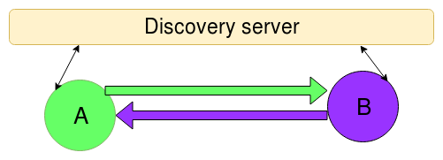

Exchange
========


### Briefly

- `ca` - generates A-feed, and subscribed to B-feed
- `cb` - generates B-feed, and subscribed to A-feed

```
A-feed: 022241cd1857ec73b7741ccb5d5494743e1ef7075ec71d6eca59979fd6be58758c
B-feed: 030c398e49cb77e83baa3110f99a105a33e5caf4e63c4ff55dbbaabbc98159e792
```


Both, `ca` and `cb` are listening, public and connected to discovery server.
The discovery server connects the nodes between (one connection, actually).



### Discovery

Original discovery server placed at `github.com/skycoin/skywire/cmdx/discovery`,
but for this examples used modified version of the discovery that uses
random seed for every start (and doesn't keep it) and SQlite3 DB in memory.

### Run

Four terminals required.

Launch the discovery server using "[::1]:8008" address in first terminal
```
go run $GOPATH/src/github.com/skycoin/cxo/intro/discovery/discovery \
    -a [::1]:8008
```

In another terminal launch the `ca` node
```
go run $GOPATH/src/github.com/skycoin/cxo/intro/discovery/exchange/ca/ca.go
```

And finally, in another terminal launch the `cb` node
```
go run $GOPATH/src/github.com/skycoin/cxo/intro/discovery/exchange/cb/cb.go
```


The `ca` and the `cb` nodes show received Root objects

---
