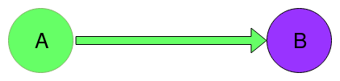

Send and receive
================

There are source and destination nodes. The source node generates and shares
a feed. The destination node connected to the source and subscribed to the feed.

No discovery servers used.



#### Start

Two terminals required.

Launch the `src` node
```
go run $GOPATH/src/github.com/skycoin/cxo/intro/send_receive/src/src.go
```

Wait a little time to let the `src` start its TCP listener. Waiting more, you
can see how node skips old Root objects sending last.

And finally, in another terminal launch the `dst` node
```
go run $GOPATH/src/github.com/skycoin/cxo/intro/send_receive/dst/dst.go
```

The `dst` node shows received Root objects. Unlike the `discovery` examples
the `dst` decodes received values in golang values

---
